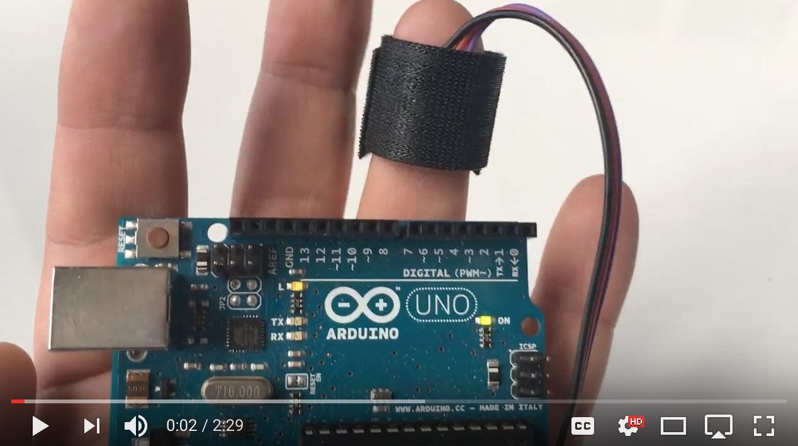
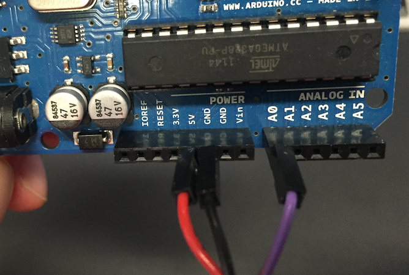
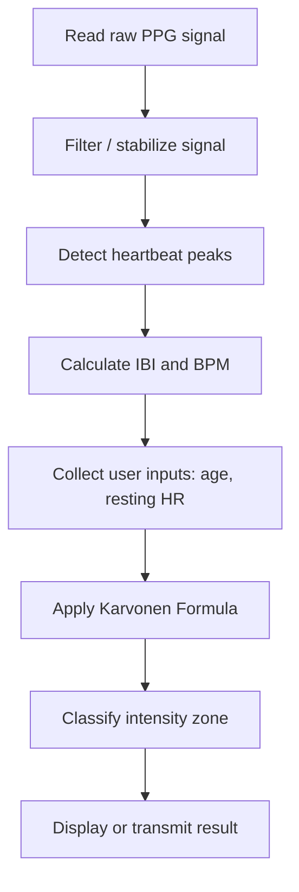

# Heart Rate-Based Exercise Intensity Monitor

A heart rate monitoring project that uses a **PPG sensor** and **Arduino-based signal processing** to estimate exercise intensity with the **Karvonen Formula (카보넨 공식)**.

This repository is centered on the Arduino pulse-sensor implementation and supporting reference assets. It documents how heart rate data can be measured, interpreted, and mapped to practical exercise intensity ranges.

---

## Project Overview

Maintaining the right exercise intensity matters for different goals such as rehabilitation, fat burning, cardiovascular endurance, and athletic performance.

This project focuses on:

- measuring heart rate from a PPG sensor
- calculating BPM from the sensor signal
- estimating target exercise intensity with the Karvonen formula
- organizing the Arduino-side implementation and reference material in one place

---

## Repository Structure

```text
exercise-intensity-monitor/
├─ README.md
└─ PulseSensor_Amped_Arduino-master/
   ├─ README.md
   ├─ video-still.png
   ├─ pics/
   └─ PulseSensorAmped_Arduino_1.5.0/
      ├─ PulseSensorAmped_Arduino_1.5.0.ino
      ├─ AllSerialHandling.ino
      ├─ Interrupt.ino
      └─ Timer_Interrupt_Notes.ino
```

---

## Device Overview



The prototype concept is built around the following hardware:

- PPG heart rate sensor
- Arduino microcontroller
- Bluetooth communication module
- portable power supply
- wearable or handheld enclosure

---

## Circuit Connection



The PPG sensor detects blood volume changes in the skin and converts them into electrical signals.

The Arduino samples the analog signal, detects beats, and calculates **BPM (Beats Per Minute)** from the measured pulse intervals.

---

## PPG Sensor Principle

Photoplethysmography (PPG) is an optical measurement technique used to detect changes in blood volume in microvascular tissue.

The sensor works by:

1. emitting light into the skin  
2. receiving reflected light from blood vessels  
3. measuring periodic changes caused by heartbeats  

These periodic changes are then used to estimate heart rate.

---

## System Architecture


The current repository mainly contains the **sensor-side Arduino implementation and reference assets**. Display or mobile integration can be connected on top of this flow, but that application layer is not the main implementation stored here.

---

## Hardware Components

| Component | Description |
|---|---|
| Arduino Uno | Microcontroller for signal sampling and BPM calculation |
| Pulse Sensor / MAX30102-class PPG sensor | Heart rate detection |
| HC-06 Bluetooth Module | Optional wireless transmission |
| Battery Module | Portable power supply |
| Jumper Wires | Circuit connection |

---

## Exercise Intensity Calculation

### Karvonen Formula (카보넨 공식)

Exercise intensity is estimated using the **Karvonen Formula**, which calculates a personalized target heart rate based on age, resting heart rate, and training intensity.

`Target HR = (HRmax − HRrest) × Intensity + HRrest`

Where:

- **HRmax** = `220 − age`
- **HRrest** = resting heart rate
- **Intensity** = target training intensity

This formula is useful because it reflects personal condition more meaningfully than using a fixed heart rate threshold alone.

---

## Exercise Intensity Levels

The project organizes exercise intensity into four practical ranges.

| Level | Intensity Range | Purpose |
|---|---|---|
| Level 1 | 50-60% | Rehabilitation / Light activity |
| Level 2 | 60-70% | Fat burning / General fitness |
| Level 3 | 70-80% | Cardiovascular endurance |
| Level 4 | 80-90% | High intensity training |

---

## Personalized Exercise Recommendation

The recommended range can be adjusted depending on the user.

### Patient / Rehabilitation

- **Recommended range:** 50-60%
- **Use cases:** recovery training, rehabilitation, elderly users

### General Users

- **Recommended range:** 60-70%
- **Use cases:** fat burning, daily fitness, sustainable cardio

### Athletes

- **Recommended range:** 70-90%
- **Use cases:** endurance training, performance improvement

---

## Exercise Intensity Algorithm



In practice, the workflow is:

1. read the raw pulse signal from the sensor
2. detect heartbeat timing from the waveform
3. calculate BPM from beat intervals
4. apply the Karvonen formula with personal inputs
5. classify the result into an exercise intensity range

---

## Arduino Code Explanation

The Arduino-side code in `PulseSensor_Amped_Arduino-master/PulseSensorAmped_Arduino_1.5.0/` handles the main low-level processing.

### 1. Sensor Data Acquisition

The pulse sensor provides an analog signal that changes with blood flow. The Arduino continuously samples this signal.

### 2. Beat Detection and BPM Calculation

The code detects pulse peaks and computes:

- **IBI (Inter-Beat Interval)**: time between beats
- **BPM (Beats Per Minute)**: heart rate derived from recent intervals

### 3. Serial Output

The measured signal, BPM, and related values can be sent through serial output for debugging, plotting, or downstream use.

### 4. Extension for Exercise Intensity

On top of the measured BPM, exercise intensity can be classified by applying:

- resting heart rate
- age-based maximum heart rate
- target intensity ratio

This makes the raw pulse data more meaningful for exercise guidance.

---

## Notes

- The repository currently contains the Arduino pulse-sensor project and documentation assets.
- Some higher-level features described conceptually, such as app-side presentation, may require additional implementation outside this repository.
- If you want this page to feel more complete on GitHub, the next best addition would be a real device photo or app screenshot placed in a top-level `images/` folder.

---

## One-Line Summary

> An Arduino-based heart rate monitoring project that uses PPG sensing and the Karvonen formula to estimate exercise intensity ranges.
